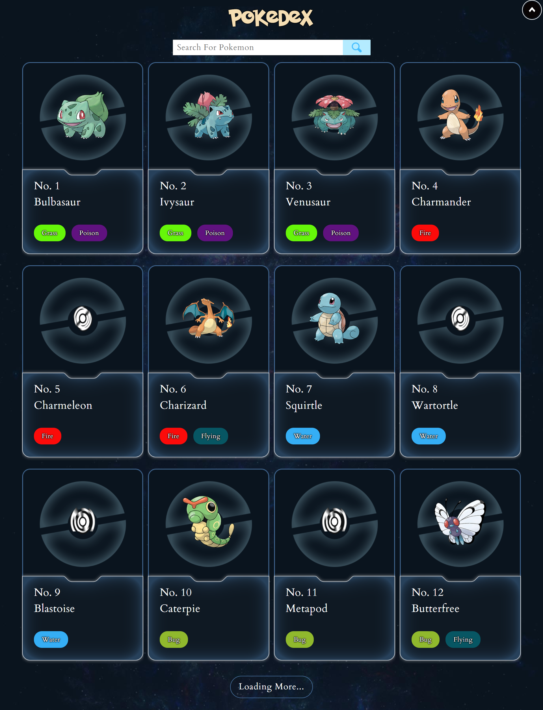
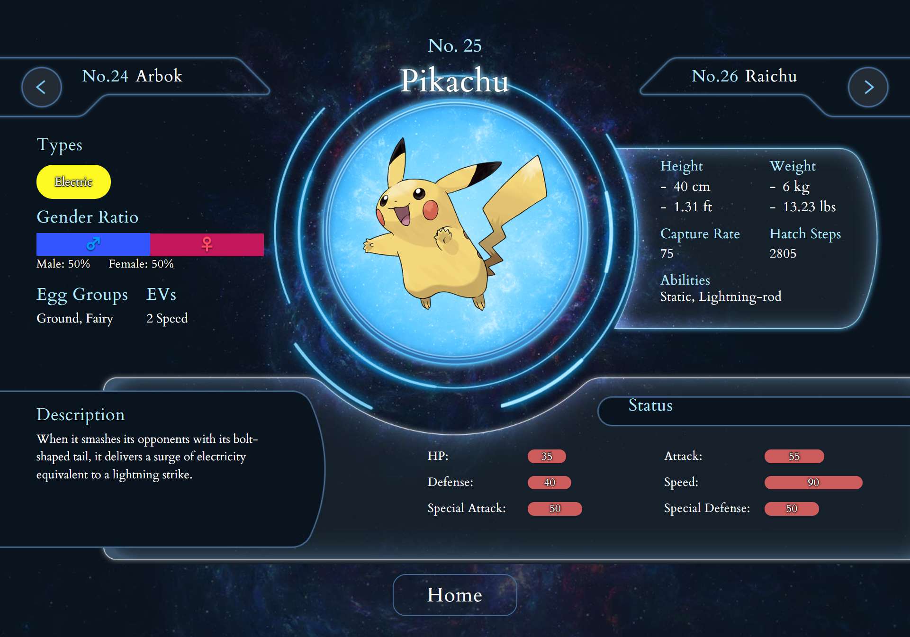

# Pokedex API Web Application

A modern **Pokédex system** built with **React.js** that integrates with the [PokéAPI](https://pokeapi.co/).  
This project helps users **search, browse, and explore Pokémon information** with a clean and responsive interface.

---

<p align="center">
   <a href="https://raw.githubusercontent.com/nithasp/pokedex-new/master/screenshots/sc1.jpg" target="_blank">
    
  </a>
   <a href="https://raw.githubusercontent.com/nithasp/pokedex-new/master/screenshots/sc2.jpg" target="_blank">
    
  </a>
</p>

---

## 🚀 Features

- 🔍 **Search & Filter** — Quickly find Pokémon by name or ID.  
- 📖 **Detailed Info Pages** — View Pokémon stats, images, and descriptions.  
- ⚡ **Optimized Performance** — Lazy loading for images and smooth navigation with React Router.  
- 🎨 **Modern UI/UX** — Styled Components for reusable and responsive design.  
- 🌐 **API Integration** — Real-time data fetching from PokéAPI using Axios.  

---

## 🛠️ Tech Stack

- **Frontend:** React.js, React Router, Styled Components  
- **API & Data:** Axios, PokéAPI  
- **UI Enhancements:** React Lazy Load Image, React Scroll  
- **Tooling:** React Scripts, ESLint, Web Vitals  

---

## 📦 Installation

1. Clone the repository:
   ```bash
   git clone https://github.com/nithasp/pokedex-new
   ```

2. Navigate to the project directory:
   ```bash
   cd pokedex-new
   ```

3. Install dependencies:
   ```bash
   npm install
   ```

4. Start the development server:
   ```bash
   npm start
   ```

5. Open your browser at:
   ```bash
   http://localhost:3000
   ```